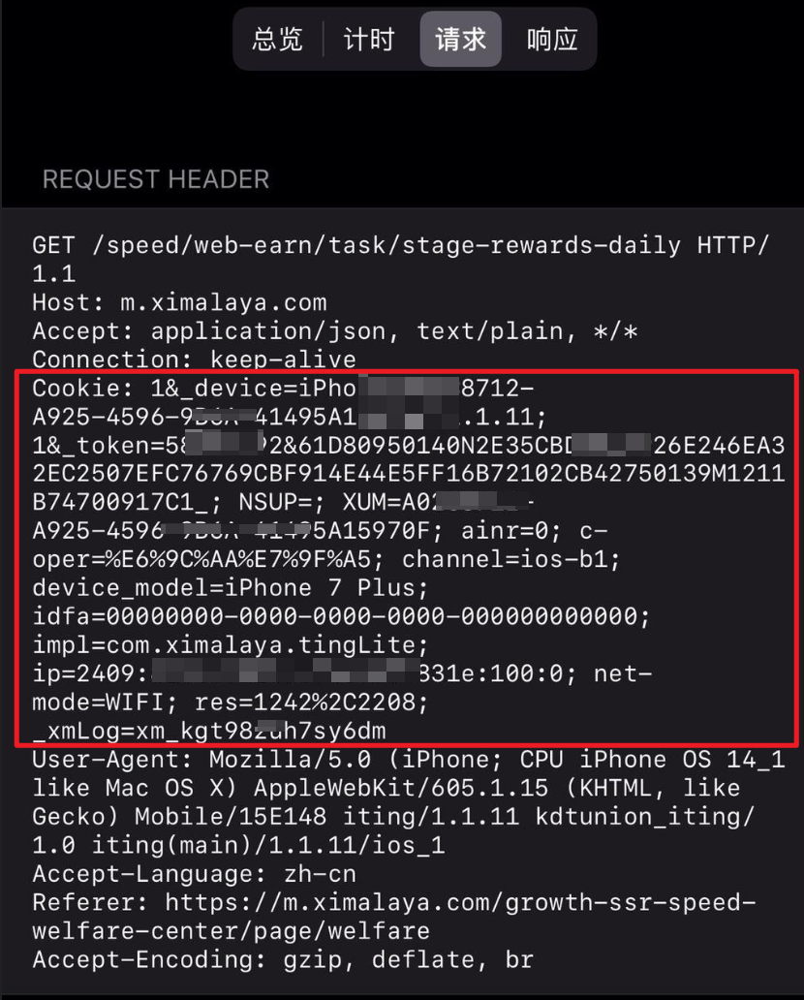

# 喜马拉雅极速版  

喜马拉雅**极速版**自动化脚本    
请仔细阅读本说明     

 [xmly_speed](xmly_speed.py)   
 cron   */30 * * * *   (30分钟运行一次,不要修改)

### 支持功能
~~1.幸运转盘4次~~  收益过低,且容易报错,故去除  
2.答题(完整)  
3.听书集卡获得抽卡机会、领取万能卡  
4.首页、宝箱奖励及翻倍(完整)    
5.自动刷收听时长(可选项)     
6.每日签到，除了第30天   
7.每日通知 

### 邀请任务
[注册链接直达](http://xima.tv/txgYId) (手机号注册)    

### 账号注册以及风控
1、使用**不同的手机设备**进行注册、刚注册的账号**不要退出**  
2、同一手机**不要切换**账号  
3、前三天需要手动完成任务

### Note
- **有些游戏 第一次需要手动运行**
- ~~旧脚本会刷收听时长，因此而黑号的，本人概不负责，请知悉（最新代码已经移除）~~ 最新版本修订为可选项
- 似乎并没有出现黑号情况，故默认打开  
- 不要询问 **可以通过简单搜索就可以知道答案** 的问题

### 运行方案

1、GitHub action自动运行，账号信息读取自 `Setting -> Secrets` 仓库位置 

- cookie 信息抓包自**手机app(喜马拉雅极速版)**，域名为 `m.ximalaya.com`的可以
- fork 本项目
- **必须**  Secrets 新增 `XMLY_SPEED_COOKIE`，填入cookie信息 ，多账号换行
- star一下，立即执行，观察运行情况
-  **必须**  修改一次文件（比如自己库中的README.md文件）才能定时运行   (！！！！不要再问为什么不能自动运行;不懂不要修改cron )  
-  **可选**  通知服务, bark服务、server酱或者tg通知可选, 分别在 Secrets  新增 `BARK` 或者 `SCKEY` 或者(`TG_BOT_TOKEN`与`TG_USER_ID`), 并填写对应的参数;每天默认19:30通知一次

2、下载到本地运行   
   - 需要第三方库 `requests`  
   - 填写方案2  
   - **必须**  本地填写cookies  
   - **可选**  `BARK`、 `SCKEY`、(`TG_BOT_TOKEN`与`TG_USER_ID`) 通知服务

### 如何抓包cookie
- [手机抓包工具汇总](https://blog.zengrong.net/post/capture-package-on-phone/)
- [Stream -- iPhone上抓包神器](抓包.png)

   

框中信息，不包含开头的`Cookie: `

### 脚本同步（不fork，防止关联上游仓库，被一锅端）

- 新建一个仓库
- 申请Personal access tokens  参考 https://www.jianshu.com/p/bb82b3ad1d11
- **必须** 在 Secrets 中新增 'PAT' 填入上面申请的 Personal access tokens
- 在自己新建的仓库中创建一个workflow，内容如此：https://raw.githubusercontent.com/Zero-S1/xmly_speed/master/.github/workflows/sync-repo.yml
- 手动运行该 workflow，可以看到上游仓库被同步到你的自建仓库
- **必须**  其他 Secrets 填写与运行方案1相同

### 查看action运行情况
点击 Actions -> Workflows

